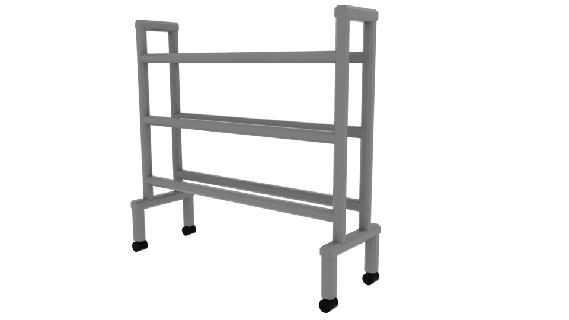
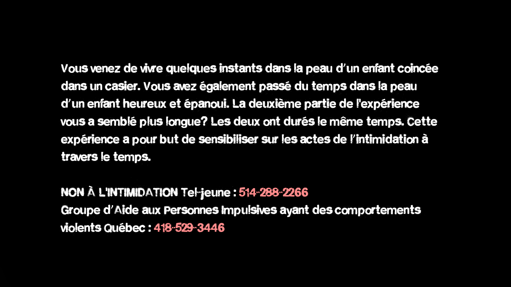

# Journal de création

## Semaine 1

Tout d’abord, comme prévu, nous avons commencé nos journaux individuels. Puis, nous avons trouvé le nom de notre projet en français après un brainstorm de noms. Il sera finalement appelé "3 minutes", car les deux parties du projet dure trois minutes.

Samuel a trouvé des inspirations pour la musique du jeu VR et a commencé à explorer le site Internet BeepBox. Ce dernier permet de créer de la musique facilement et sans logiciel supplémentaire. Très pratique pour un débutant! Samuel est maintenant en train de créer cette musique dans BeepBox.

Naoufal a commencé la proggrammation du timer de 3 minutes du jeu. On a brainstorm pour trouver plus de modèles 3d. Apres le brainstorm nous avons choisis que nous allons créer un panier de basketball, une radio, un rack et une porte de gymnase. 

## Semaine 2
-Achat de matériaux pour la structure du casier
-Assemblage de la structure
-Continuation de la préproduction
-Création model 3d
-Création du Logo
-Début de la création des sons pour le jeu de réalité virtuel

ACHAT DE MATÉRIAUX POUR LA STRUCTURE DU CASIER : Naoufal et Jérémie

ASSEMBLAGE DE LA STRUCTURE : Jérémie

CRÉATION MODEL 3D : Naoufal, Jérémie et Samuel

CRÉATION DU LOGO : Jérémie

## Semaine 3
Location du matériel que nous avons de besoin pour la création du projet:

Création des textures de certain objets 3d

Correction des bugg relier au casque vr dans unity

Renforcement de la structure en pvc 

## Semaine 4
Installation du casier et des panneaux de coroplast dans le couloir

Branchement et tests sonores des gros speakers 

Création de modèles 3d

## Semaine 5
Installation des 8 hauts-parleurs et test de son
Branchement des deux lumières

Détecteur de mouvement

Unity placement scène final
Toit du casier installer
QLC+ gestion des lumières

Enregistrement son radio et ballon
Branchement moniteur et test de fonctionalité
## Semaine 6
-Finaliser les max 

-Enregistrer les insultes 

-Finir le fade 

-Création de la porte du casier et le frame de la porte

-Finalisation des menus
-Ambiance sonore finale presque terminée.

## Semaine 7
Finalisation du projet autant dans l'audio que dans le jeu vr.
création menu, score, cible et nice to have 
## Semaine 8

