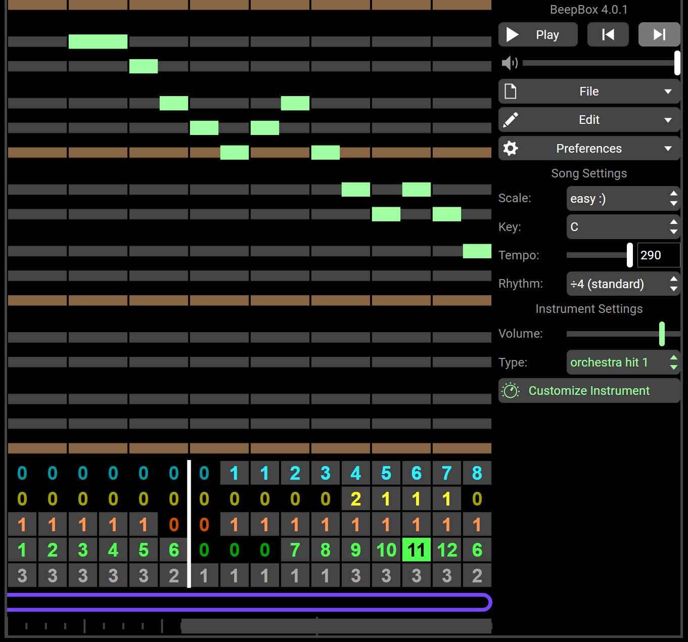
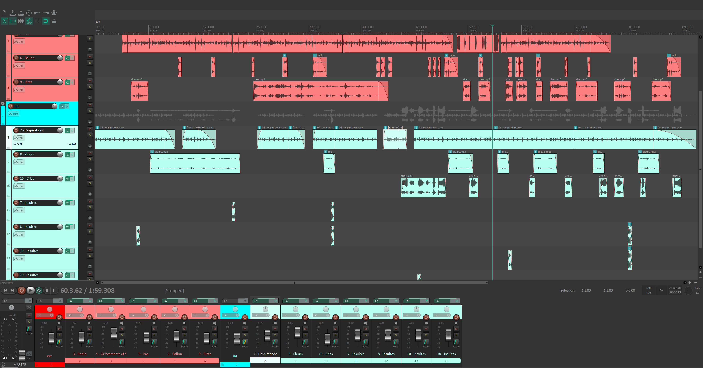
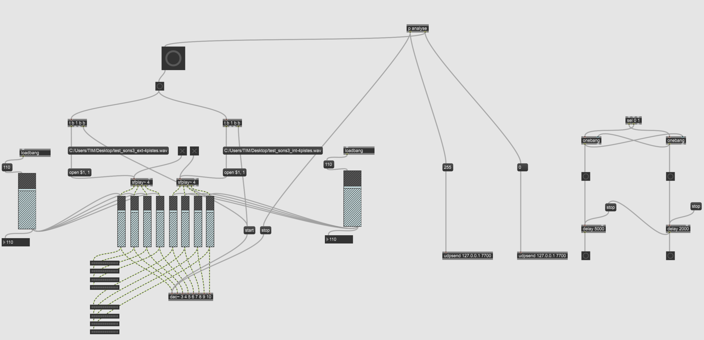

# Journal de Samuel Poulin

* [Semaine 1](#semaine-1)
* [Semaine 2](#semaine-2)
* [Semaine 3](#semaine-3)
* [Semaine 4](#semaine-4)
* [Semaine 5](#semaine-5)
* [Semaine de rattrapage](#semaine-de-rattrapage)
* [Semaine 6](#semaine-6)
* [Semaine 7](#semaine-7)
* [Semaine 8](#semaine-8)
* [Semaine 9](#semaine-9)

## Semaine 1

### Résumé des réalisations effectuées
- Début du journal.
- Nous avons trouvé le nom du projet en français.
- Trouvé des inspirations pour la musique du jeu VR.
- Explorer BeepBox.

### Est-ce que j'ai accompli l'ensemble des tâches et objectifs que je m'étais fixés pour cette semaine?	
- [x] Complètement
- [ ] Assez
- [ ] Peu
- [ ] Pas du tout

#### Décrivez pourquoi. 
- J'ai bien commencé mon journal.

### Mon projet s'est-il réalisé selon l’échéancier prévu?

- [x] Complètement
- [ ] Assez
- [ ] Un peu
- [ ] Pas tout à fait

### Défis pour la prochaine semaine
- Création de la musique pour le jeu VR.

---

## Semaine 2
### Résumé des réalisations effectuées
- Création de la musique pour le jeu VR.
- Modélisation en 3D de portes de gymnases sans textures.

### Image d'une réalisation dont tu es la ou le plus fier

### Est-ce que j'ai accompli l'ensemble des tâches et objectifs que je m'étais fixés pour cette semaine?

- [x] Complètement
- [ ] Assez
- [ ] Peu
- [ ] Pas du tout

#### Décrivez pourquoi.
 J'ai bien créé la musique dans BeepBox et modélisé les portes de gymnases en 3D dans Maya.

### Mon projet s'est-il réalisé selon l’échéancier prévu?

- [x] Complètement
- [ ] Assez
- [ ] Un peu
- [ ] Pas tout à fait

### Défis pour la prochaine semaine
- Peaufiner l'ambiance sonore du casier dans Reaper.
- Enregistrer des sons/trouver des sons pour l'ambiance sonore du casier.

---
## Semaine 3 
### Résumé des réalisations effectuées
- Correction de fautes d'orthographe dans la préproduction.
- Création de la musique du menu pour le jeu VR.
- Création de l'inventaire de contenu multimédia (avec Jérémie).
- Modéliastion en 3D d'une échelle de gymnase.
- Création des textures pour les portes de gymnase.
- Création des textures pour l'échelle.

### Image d'une réalisation dont tu es la ou le plus fier

### Est-ce que j'ai accompli l'ensemble des tâches et objectifs que je m'étais fixés pour cette semaine?

- [ ] Complètement
- [ ] Assez
- [x] Peu
- [ ] Pas du tout

#### Décrivez pourquoi.
 Nous avons décidé de faire les sons plus tard et finir le jeu VR avant de commencer à aller plus loin dans le son.

### Mon projet s'est-il réalisé selon l’échéancier prévu?

- [x] Complètement
- [ ] Assez
- [ ] Un peu
- [ ] Pas tout à fait

### Défis pour la prochaine semaine
- Tester l'univers sonore.
---
## Semaine 4
### Résumé des réalisations effectuées
- Modélisation en 3D d'un horloge murale.
- Modélisation en 3D d'un rack à ballons.
- Aide pour l'installation de la structure du casier.
- Aide pour l'achat des panneaux de coroplast pour le casier.
- Aide pour test sonore avec les haut-parleurs.

### Image d'une réalisation dont tu es la ou le plus fier

### Est-ce que j'ai accompli l'ensemble des tâches et objectifs que je m'étais fixés pour cette semaine?

- [ ] Complètement
- [x] Assez
- [ ] Peu
- [ ] Pas du tout

#### Décrivez pourquoi.
 Les haut-parleurs fonctionnent, mais pas la spatialisation.

#### S'il y a lieu, qu'allez-vous faire pour remédier à la situation?
Demander de l'aide à  Daryl ou Guillaume si disponible.

### Mon projet s'est-il réalisé selon l’échéancier prévu?

- [x] Complètement
- [ ] Assez
- [ ] Un peu
- [ ] Pas tout à fait

### Défis pour la prochaine semaine
- Faire fonctionner la spatialisation des haut-parleurs.
---
## Semaine 5
### Résumé des réalisations effectuées
- Faire fonctionner les petits et les gros haut-parleurs.
- Avancement dans Reaper pour l'ambiance sonore du casier.
- Aide pour faire fonctionner les lumières.

### Est-ce que j'ai accompli l'ensemble des tâches et objectifs que je m'étais fixés pour cette semaine?

- [x] Complètement
- [ ] Assez
- [ ] Peu
- [ ] Pas du tout

#### Décrivez pourquoi.
Tous les haut-parleurs fonctionnent.

### Mon projet s'est-il réalisé selon l’échéancier prévu?

- [x] Complètement
- [ ] Assez
- [ ] Un peu
- [ ] Pas tout à fait

### Défis pour la prochaine semaine
- Continuer l'ambiance sonore dans Reaper.

---
## Semaine de rattrapage
### Résumé des réalisations effectuées
- Ajouter la programmation du deuxième capteur de présence dans Max 8.
- Création de l'écran de fin (choix couleur du fond, du texte et typographie)
- Création d'une liste de crédits pour les sons libres de droits.
- Ambiance sonore du casier assez avancée.
- Enregistrement du son de grincements de souliers avec Naoufal.

### Image d'une réalisation dont tu es la ou le plus fier

### Est-ce que j'ai accompli l'ensemble des tâches et objectifs que je m'étais fixés pour cette semaine?

- [x] Complètement
- [ ] Assez
- [ ] Peu
- [ ] Pas du tout

#### Décrivez pourquoi.
L'ambiance sonore est très bien avancée et pourrait même être finale.

### Mon projet s'est-il réalisé selon l’échéancier prévu?

- [x] Complètement
- [ ] Assez
- [ ] Un peu
- [ ] Pas tout à fait

### Défis pour la prochaine semaine
- Finaliser l'ambiance sonore du casier.

---
## Semaine 6
### Résumé des réalisations effectuées
- Aide achat de la porte du casier.
- Aide pour la pose de la porte du casier.
- Ambiance sonore finale presque terminée.

### Image d'une réalisation dont tu es la ou le plus fier

### Est-ce que j'ai accompli l'ensemble des tâches et objectifs que je m'étais fixés pour cette semaine?

- [ ] Complètement
- [x] Assez
- [ ] Peu
- [ ] Pas du tout

#### Décrivez pourquoi.
 L'ambiance sonore n'est pas tout à fait terminée, mais elle l'est presque. Ce n'est pas la priorité.

#### S'il y a lieu, qu'allez-vous faire pour remédier à la situation?
Avancer les choses prioritaires avant de continuer l'ambiance sonore.

### Mon projet s'est-il réalisé selon l’échéancier prévu?

- [x] Complètement
- [ ] Assez
- [ ] Un peu
- [ ] Pas tout à fait

### Défis pour la prochaine semaine
- Finir l'ambiance sonore du casier.

---
## Semaine 7
### Résumé des réalisations effectuées
- Ambiance sonore finalisé.
- Programmation du pach max du son terminé.
- Exportation des sons du casier (4 et 4 pour l'intérieur et l'extérieur séparément).
- Création d'une musique de victoire simple pou le jeu VR.
- Aide pour brancher le deuxième moniteur.
- Modification de deux sons dans Reaper pour le jeu VR.

### Image d'une réalisation dont tu es la ou le plus fier

### Est-ce que j'ai accompli l'ensemble des tâches et objectifs que je m'étais fixés pour cette semaine?

- [x] Complètement
- [ ] Assez
- [ ] Peu
- [ ] Pas du tout

#### Décrivez pourquoi.
Tout est finalisé.

### Mon projet s'est-il réalisé selon l’échéancier prévu?

- [x] Complètement
- [ ] Assez
- [ ] Un peu
- [ ] Pas tout à fait

### Défis pour la prochaine semaine
- Présenter le projet.
- S'assurer que tout fonctionne.

## Semaine 8

## Semaine 9
