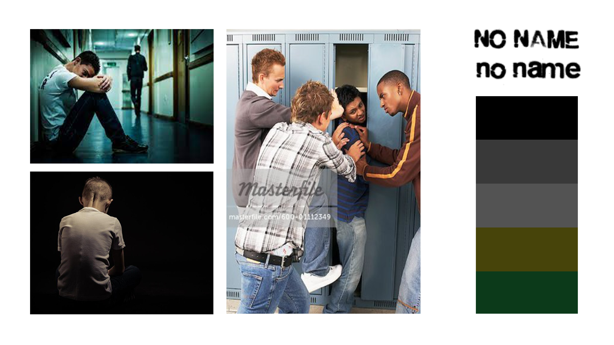
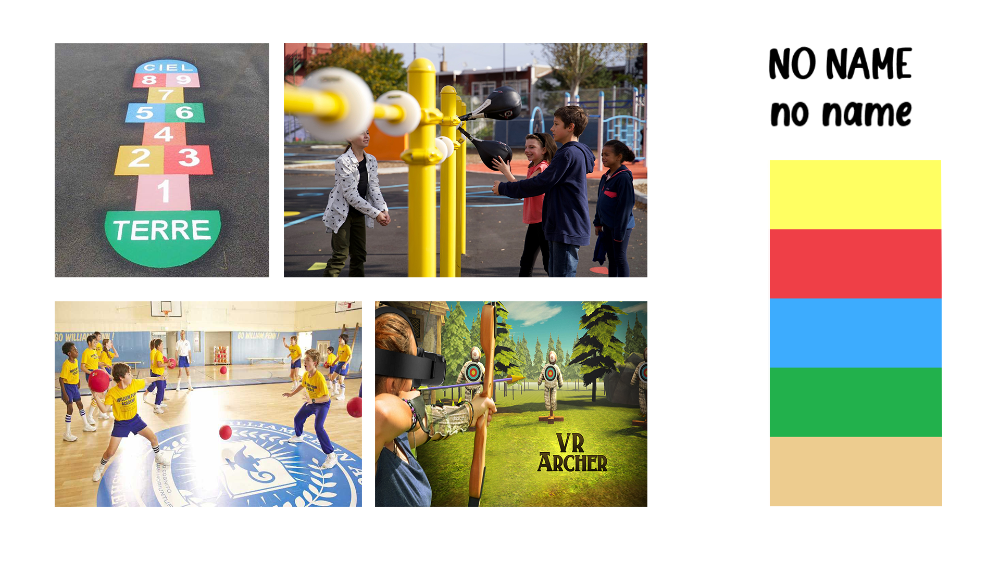
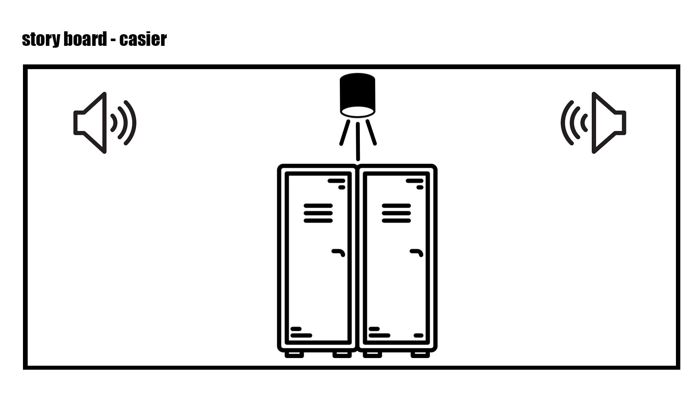
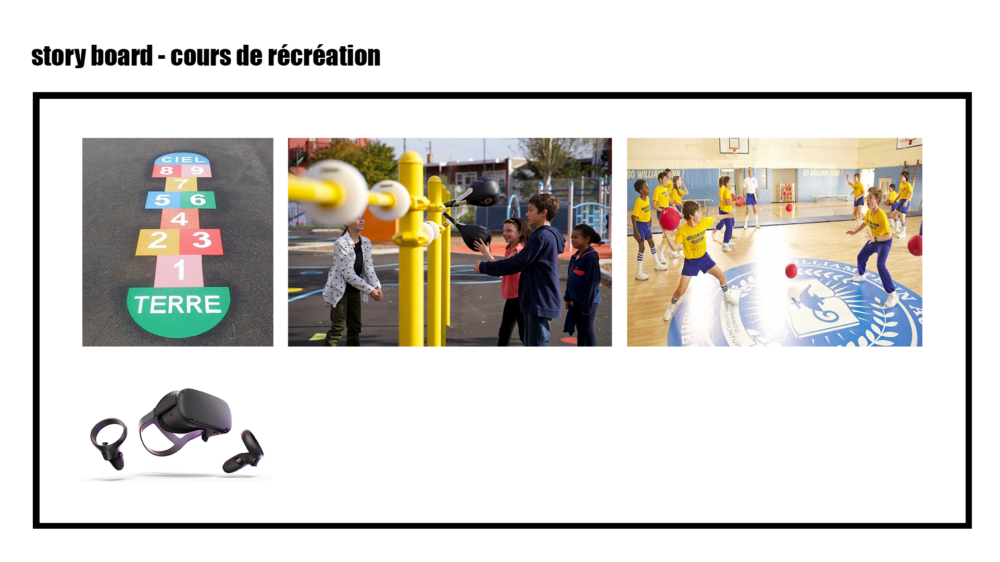
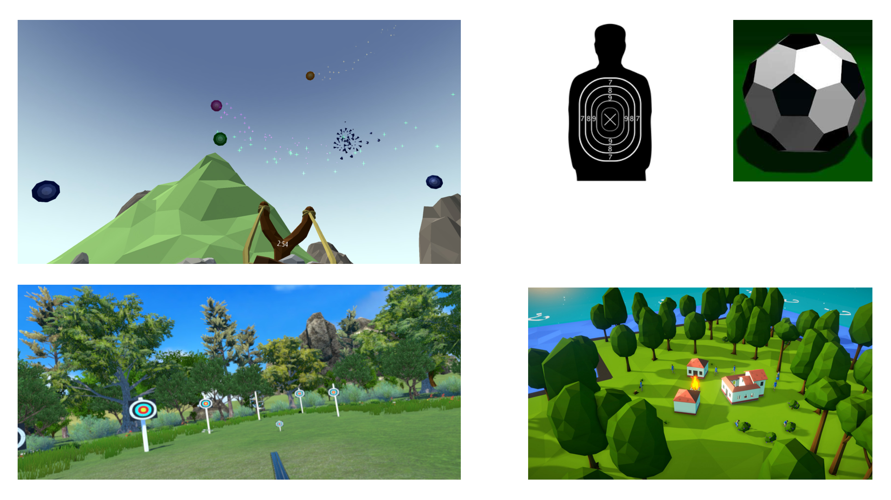
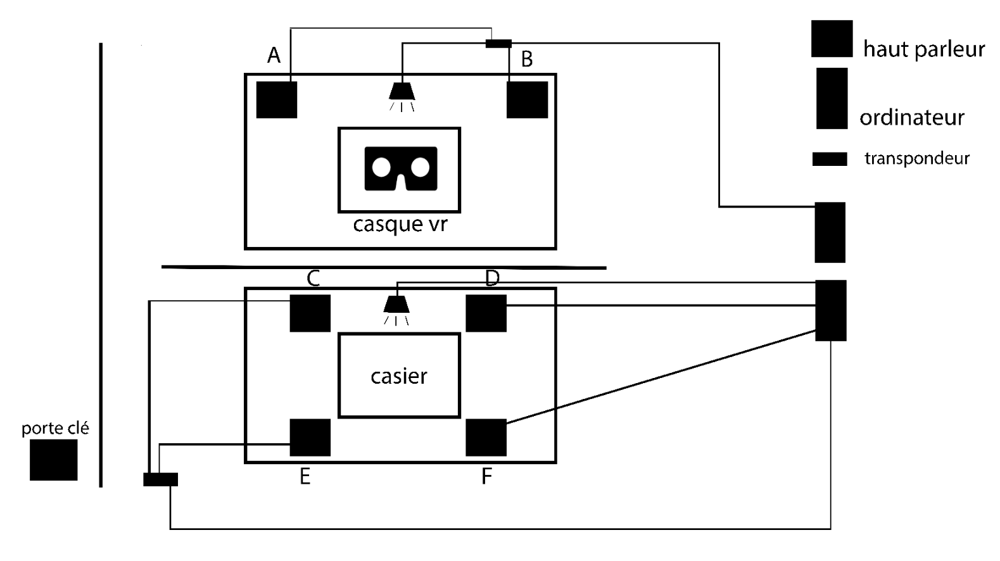
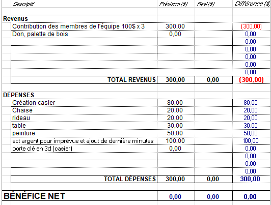

# Préproduction
> C'est ici qu'on dépose les éléments de la préproduction.

# Table des matières
1. [Intention ou concept](#Intention-ou-concept)
    - [Cartographie](#Cartographie)
    - [Intention de départ](#Intention-de-départ)
    - [Synopsis](#Synopsis)
    - [Tableau d'ambiance (*moodboard*)](#Tableau-d'ambiance-(*moodboard*))
    - [Scénario, scénarimage ou document audio/visuel](#Scénario,-scénarimage-ou-document-audio/visuel)
2. [Planification technique d'un prototype (devis technique)](#Planification-technique-(devis-technique))
    - [Schémas ou plans techniques](#Schémas-ou-plans-techniques)
    - [Matériaux requis](#Matériaux-de-scénographie-requis)
    - [Équipements requis](#Équipements-requis)
    - [Logiciels requis](#Logiciels-requis)
    - [Ressources humaines requises](#Ressources-humaines-requises)
    - [Ressources spatiales requises (rangement et locaux)](#Ressources-spatiales-requises-(rangement-et-locaux))
    - [Contraintes techniques et potentiels problèmes de production](#Contraintes-techniques-et-potentiels-problèmes-de-production)
3. [Planification de la production d'un prototype (budget et étapes de réalisation)](#Planification-de-la-production-(budget-et-étapes-de-réalisation))
    - [Budget prévisionnel](#Budget-prévisionnel)
    - [Échéancier global](#Échéancier-global)
    - [Liste des tâches à réaliser](#Liste-des-tâches-à-réaliser)
    - [Rôles et responsabilités des membres de l'équipe](#Rôles-et-responsabilités-des-membres-de-l'équipe))
    - [Moments des rencontres d'équipe](#Moments-des-rencontres-d'équipe)

# Intention ou concept
## Cartographie
> Exemples:

## Intention de départ
À travers le temps, sensibiliser la personne à l'intimidation en lui faissant passer du bon temps, suivi par du mauvais temps.
Immersion dans la peau d’une personne d’un enfant non intimidé jouant dans la cour de récréation vs dans la peau d’un enfant intimidé et enfermé dans un casier. 
Ce projet, fait vivre a l'utilisateur un sentiments d'impuissance et détresse. Ce qui as pour but de faire comprendre l'importance de ne pas laisser une personne seul dans ce genre de situation. Ainsi, l'utilisateur resent de l'empathie a l'égard des personnes intimidés.

## Synopsis
Tu es enfermé dans un casier sombre et glacial pour la 89 ème fois cette année le temps te paraît une éternité des rires moqueurs, ta respiration devient de plus en plus insupportable, l'angoisse commence à prendre le dessus 5 minutes devient un long moment interminable.

Tu es dans la cour de récréation ou tu t'amuses a jouer a plusieurs jeux différents le temps passe trop rapidement.

## Tableau d'ambiance (*moodboard*)

## Scénario, scénarimage ou document audio/visuel
L’utilisateur entre dans la salle, il ouvre la porte et tombe sur casque vr reposant sur un piédestal. En mettant le casque vr un jeu de ballon chasseur apparaît.
 

Dans ce jeu tu as un nombre infini de ballons pour toucher les cibles, il faut toucher le plus de cible possible dans le temps impartie de 3 minutes selon le résultat une animation apparaît avec le score.
 

Dans tous les cas, l'utilisateur est invité à franchir la porte pour poursuivre l'expérience.
 

L’utilisateur sera enfermé dans un casier pour une durée de 3 minutes. Dans le noir, il y aurait des respirations fortes, des rires moqueurs et des bruits de métals. Le tout pour rendre mal à l' aise l’utilisateur afin d’avoir une expérience plus immersive.
 

À la fin de l'expérience, une voix explique que la deuxième expérience vous met dans la peau d’une victime d'intimidation coincée dans un casier. Elle explique que même si les deux expériences ont duré le même temps, mentallement le temps semblait plus lent dans le deuxième.

# Contenu multimédia à intégrer
## Inventaire du contenu multimédia
## VR
* Menu de départ et de fin
* Trame sonore surround
* Texte de départ et de fin
* Jeu de réalité virtuelle
* Model 3D crée dans maya
* Modules multimedias (Kinect, contrôle d'éclairage, Ellipsoidal Spot et Jeu de réalité virtuelle)
## Casier
* Trame sonore Surround
* Capteur lorsque la porte s'ouvre
* Modules multimedias (effets audio, contrôle d'éclairage et Ellipsoidal Spot)
## Univers artistique des éléments
https://www.google.ca/search?q=jeu+de+cible+vr&hl=fr&sxsrf=AOaemvLRObMse42gEqFIRSJgMGfUfiSteA:1639597571517&source=lnms&tbm=isch&sa=X&ved=2ahUKEwjRhcz2yOb0AhWSMd8KHVI8AR0Q_AUoAXoECAEQAw&biw=720&bih=715&dpr=1.25#imgrc=hDdag0QrS07Q0M
* Ballon : https://www.bing.com/images/search?view=detailV2&ccid=bC09%2fXu%2f&id=60E2BCB0949A83A4133AE1ED5BBA69D147D17055&thid=OIP.bC09_Xu_qnv6Fz6DPgA2eQHaHa&mediaurl=https%3a%2f%2fwww.holodatabase.com%2fwp-content%2fuploads%2fFoot_ball.png&cdnurl=https%3a%2f%2fth.bing.com%2fth%2fid%2fR.6c2d3dfd7bbfaa7bfa173e833e003679%3frik%3dVXDRR9Fpulvt4Q%26pid%3dImgRaw%26r%3d0&exph=1080&expw=1080&q=ballon+3d&simid=608013042517375634&FORM=IRPRST&ck=4F8A69B86E4A0BDD7DCBCC05CE9F142A&selectedIndex=1&ajaxhist=0&ajaxserp=0
* Cible: https://www.bing.com/images/search?view=detailV2&ccid=B58XtrdI&id=407D40EF33CAAC3F45B031730AD2CD7A0674B88F&thid=OIP.B58XtrdIVGRhKMDo8n9eDQHaIp&mediaurl=https%3a%2f%2fthumbs.dreamstime.com%2fb%2fcible-humaine-avec-des-trous-de-balle-46951070.jpg&cdnurl=https%3a%2f%2fth.bing.com%2fth%2fid%2fR.079f17b6b74854646128c0e8f27f5e0d%3frik%3dj7h0BnrN0gpzMQ%26pid%3dImgRaw%26r%3d0&exph=900&expw=771&q=Cible+Humaine&simid=608003670904618572&FORM=IRPRST&ck=E7012559BDD12F21AE15F0B5C5ADCE0B&selectedIndex=8&ajaxhist=0&ajaxserp=0
* Casier: https://www.bing.com/images/search?view=detailV2&ccid=ClljyzX7&id=B895012D36113D19962359807064A8909E9D5811&thid=OIP.ClljyzX7bl_mEc-wf-Fd1AHaHa&mediaurl=https%3a%2f%2fwww.design-market.fr%2f68367-thickbox_default%2fcasier-industriel-en-m%c3%a9tal-laqu%c3%a9-bleu-1950.jpg&cdnurl=https%3a%2f%2fth.bing.com%2fth%2fid%2fR.0a5963cb35fb6e5fe611cfb07fe15dd4%3frik%3dEVidnpCoZHCAWQ%26pid%3dImgRaw%26r%3d0&exph=800&expw=800&q=casier&simid=608050546167848650&FORM=IRPRST&ck=05AC83A3FB0B7C5B260B525E839EF57A&selectedIndex=4&ajaxhist=0&ajaxserp=0
* Banc: https://www.bing.com/images/search?view=detailV2&ccid=QO4mnivW&id=D5B2D348D998C0F0F980E87035F1C29A4CFA0622&thid=OIP.QO4mnivWmYSH6XgPHKIgKgHaHa&mediaurl=https%3a%2f%2fwww.idema.com%2ffr-BE%2fmedia%2fcatalog%2fproduct%2fcache%2f2%2fimage%2f1200x%2f9df78eab33525d08d6e5fb8d27136e95%2fa%2fe%2fae25a521-4951-481c-be1f-62d707de1d66-160906.jpg&cdnurl=https%3a%2f%2fth.bing.com%2fth%2fid%2fR.40ee269e2bd6998487e9780f1ca2202a%3frik%3dIgb6TJrC8TVw6A%26pid%3dImgRaw%26r%3d0&exph=1200&expw=1200&q=banc+de+gymnase&simid=608033933241383975&FORM=IRPRST&ck=4ABA3E63181CFD4E6BA95C2985B27C1E&selectedIndex=0&ajaxhist=0&ajaxserp=0
# Planification technique d'un prototype (devis technique)
## Schémas ou plans techniques
> Insérer plans, documents et schémas pertinents dans cette sectio.  

### Plantation 

### Schéma de branchement 

## Matériel de scénographie requis

> Liste des matériaux de scénographie (matériaux de décor) requis ou lien vers un tableur Excel ou document Markdown à part si nécessaire (quantité, spécifications techniques, lien vers fiche technique si applicable, commentaires...)

* Faux casier crée en coroplaste, carton renforcé, 2 hauts-parleurs et une chaise.
* Rideaux noirs
* Fausse porte 

## Équipements requis
> Liste des équipements requis par département ou lien vers un tableur Excel ou document Markdown à part si nécessaire (quantité, spécifications techniques, lien vers fiche technique si applicable, commentaires...)

* Audio
    * 6 haut-parleurs actifs de 4"
    * 6 fils XLR 3 conducteurs de 15' (M->F)
    * 2 interfaces audio USB disposant 4 sorties 

* Lumière
    * 2 projecteurs de lumière
    * 2 fils XLR 3 conducteurs de 20'
    * Console DMX
    * Interface DMX USB

* Réalité virtuelle
    * 1 casque de réalité virtuelle Oculus Quest 1
    * 2 manettes Oculus
    
* Téléphone
    * 1 téléphone cellulaire

* Ordinateur
    * 2 ordinateurs
    

## Logiciels requis
> Liste des logiciels requis, version ainsi que leurs dépendences

* [Max 8](https://cycling74.com/products/max)   
* [Unity 2019 lts](https://unity.com/)
* [Reaper 3.67](https://www.reaper.fm/)
* [Adobe Photoshop 22.5.1](https://www.adobe.com/)
* [Maya](https://www.autodesk.ca/fr/products/maya/overview?term=1-YEAR&tab=subscription)

## Ressources humaines requises
> Formaté en liste ou en lien vers un tableur Excel.

* TTP, location de matériel
* Voix féminine ou masculine (adolescent)

## Ressources spatiales requises (rangement et locaux)
> Spécifications des espaces nécessaires formaté en liste ou lien vers un tableur Excel.

* Grand studio
    * Grand studio divisé en deux (casier d'un côté et jeu de l'autre)

* Petit studio
    * Enregistrement audio

## Contraintes techniques et potentiels problèmes de production
> Tableau ou lien vers un tableur Excel (contraintes, problème et solution envisagée, commentaires...)

| Contrainte ou problème potentiel                 | Solution envisagée                                    | Commentaires                                                                                 |
|--------------------------------------------------|-------------------------------------------------------|----------------------------------------------------------------------------------------------|
| Création du casier, instalation lumière et son (synchronisé) |Se renseigner pour la confection du casier a une créatrice de scène de théatre, Formation avec TTP, expérimentation durant la session |Avec les ressources nécéssaires nous sommes confiant que la réalisation de notre projet sera un succès. |
|                                                  |                                                       |                                                                                              |

# Planification de la production d'un prototype (budget et étapes de réalisation)
## Budget prévisionnel

## Échéancier global
Étapes importantes du projet visualisé dans GitHub (*milestones*):  
https://github.com/noo-name/temporel/milestones

*Dates importantes :*
- Première itération : lundi x novembre
- Prototype finale : lundi x décembre
- Présentation des projets devant public : jeudi 25 mars (soir)

## Liste des tâches à réaliser
Visualisation des tâches à réaliser dans GitHub selon la méthode Kanban:  
https://github.com/noo-name/temporel/projects/1

Inventaire des tâches à réaliser dans GitHub selon le répertoire d'*issues*:  
https://github.com/noo-name/temporel/issues

## Rôles et responsabilités des membres de l'équipe
> Il vous est proposé ici de nommer une personne à la coordination générale du projet, à la coordination technique et à la coordination artistique. Les grandes décisions sur les grandes orientations du projet devraient se prendre en groupe lors de rencontres d'équipe. Cependant, les décisions entre vos rencontres de groupe devraient appartenir à ces personnes.

Jérémie 
- Coordination générale du projet (coordination de l'échéancier, du budget, suivi de la liste des tâches à réaliser, s'assurer de la répartition du rôle et des responsabilités des membres de l'équipe);
- Création des paysages sonores;
- Création des icônes de navigation;
- Modélisation 3D des objets pour le jeu Unity;
- Création du casier;
- Création des porte-clés;
- Création du jeu dans Unity;

Liste des tâches dans Git Hub:  
https://github.com/noo-name/temporel/issues?q=assignee%3AjeremieLevesque+is%3Aopen

Naoufal 
- Comité Technique et coordination technique (suivi du devis technique);
- Création des paysages sonores;
- Installation de l'équipement dans l'espace physique;
- Gestion des lumières/éclairages;
- Modélisation 3D des objets pour le jeu Unity;
- Création du jeu dans Unity;

Liste des tâches dans Git Hub:  
https://github.com/noo-name/temporel/issues?q=assignee%3ANaoufalBen+is%3Aopen

Samuel
- Coordination artistique (attention plus particulière pour s'assurer que l'intention/concept artistique du projet initial reste, sinon consulter les membres de l'équipe);
- Création du texte de fin;
- Création d'animations 3D;
- Création des effets sonores;
- Création des textures;
- Programmation du module Unity d'effets visuels;
- Création du jeu dans Unity;

Liste des tâches dans Git Hub:  
https://github.com/noo-name/temporel/issues?q=assignee%3ASamuelPoulin1+is%3Aopen

**Tâches pas encore attribuées**  
https://github.com/noo-name/temporel/issues?q=is%3Aopen+no%3Aassignee

## Moments des rencontres d'équipe
Hebdomadaire
- **Chaque mardi de (11h a 13h)** : Rencontre de suivi de projet.

Autre: 
- **Si le projet demande plus de temps notre horaire sera révisé** : Rencontre de suivi de projet.
